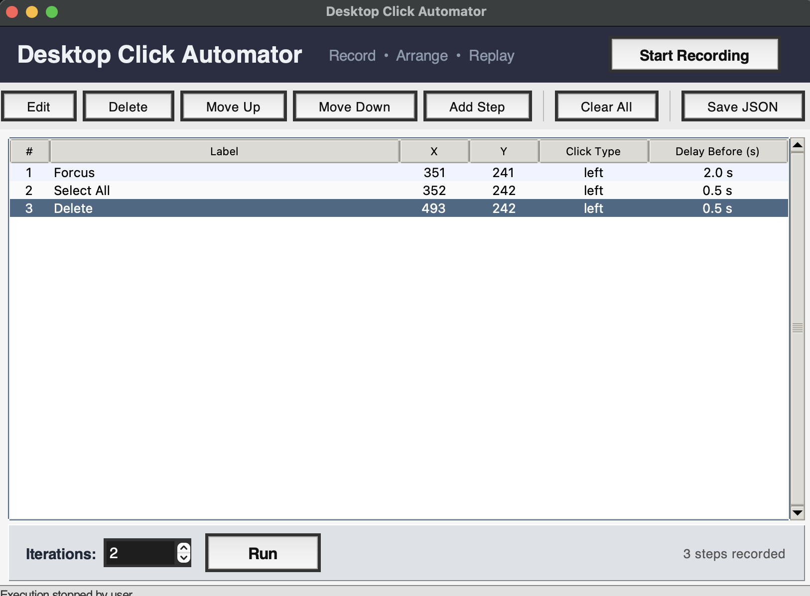
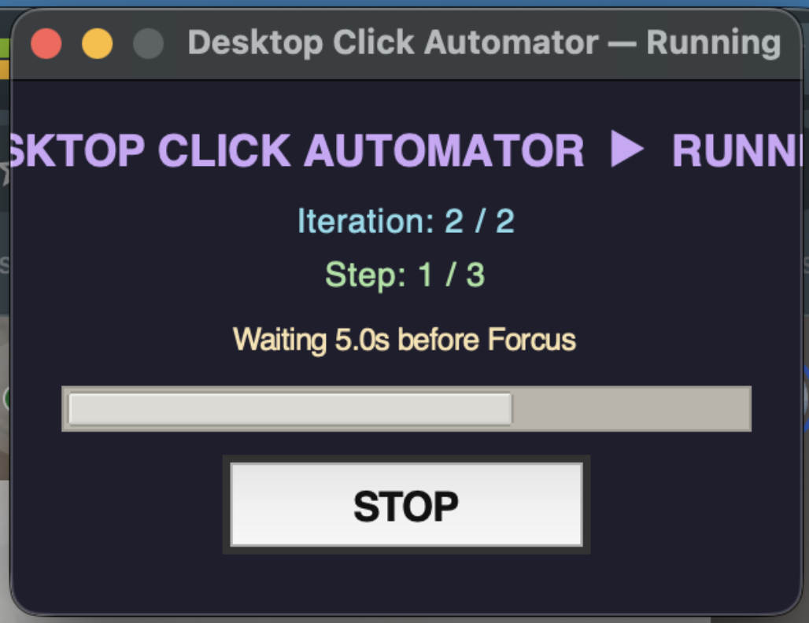

# Desktop Click Automator (macOS)

A desktop automation utility to record global mouse clicks, edit step sequences, and replay them with configurable timing.

## Overview

Desktop Click Automator provides a Tkinter GUI for building replayable click workflows:

- Record global mouse clicks from anywhere on screen
- Edit per-step coordinates, click type, label, and delay
- Reorder, delete, and manually add steps
- Save/load sequences as JSON
- Replay for N iterations with live progress overlay and stop control

## Target Platform

- macOS (primary and currently supported platform)
- Python 3.10+ recommended

## Architecture Summary

- UI Layer: Tkinter main window, dialogs, table, and execution overlay
- Recording Layer: pynput listener captures global click events
- Replay Layer: Quartz (CoreGraphics) posts synthetic mouse events
- Data Model: in-memory Step objects serialized to JSON

Main entrypoint: [clicker_tool.py](clicker_tool.py)

## Repository Structure

- [clicker_tool.py](clicker_tool.py): Main application and UI
- [requirements.txt](requirements.txt): Python dependencies
- [run.sh](run.sh): Optional launcher script

## Dependencies

Install dependencies:

pip install -r requirements.txt

Current dependencies:

- pynput: global mouse event capture
- pyobjc-framework-Quartz: synthetic mouse movement/click replay on macOS

## Setup and Run

### Option 1: Virtual environment (recommended)

1. Create environment

python3 -m venv .venv

2. Activate environment

source .venv/bin/activate

3. Install dependencies

pip install -r requirements.txt

4. Run app

python3 clicker_tool.py

### Option 2: Launcher script

chmod +x run.sh
./run.sh

## macOS Permissions (Required)

Replay and recording require macOS privacy permissions.

Open:
System Settings -> Privacy & Security

Grant these permissions to the app that runs Python (typically Terminal):

1. Accessibility
- Required for replay click delivery (Quartz CGEventPost)

2. Input Monitoring
- Required for recording global click events (pynput)

After changing permissions, restart Terminal and relaunch the app.

## Usage Guide

1. Start Recording
- Click Start Recording
- Click anywhere on screen to capture steps
- Click Stop Recording when done

2. Adjust Steps
- Double-click a step to edit
- Use Move Up/Move Down to reorder
- Add Step for manual coordinates

3. Replay
- Set iteration count
- Click Run
- Use STOP in overlay to halt execution

4. Persist Sequences
- Save JSON to export sequence
- Load JSON to restore sequence

## Screenshots

Add the following image files to the repository, so GitHub renders them inline:

### UI

### Execution

Recommended file names:

- `screenshots/ui.png` for the main application window with recorded steps
- `screenshots/execution.png` for the running overlay during replay

## JSON Sequence Format

Sequence file structure:

{
  "version": 1,
  "steps": [
    {
      "x": 1200,
      "y": 700,
      "click_type": "left",
      "delay_before": 0.5,
      "label": "Optional label"
    }
  ]
}

Supported click_type values:

- left
- right
- double

## Troubleshooting

### Mouse moves but does not click

Cause: Accessibility permission is missing or not trusted for the current process.

Actions:

1. Confirm Terminal is enabled in Accessibility settings
2. Fully quit and reopen Terminal
3. Re-activate virtual environment and rerun app

Quick trust check:

python3 - <<'PY'
import ctypes
ax = ctypes.CDLL('/System/Library/Frameworks/ApplicationServices.framework/ApplicationServices')
ax.AXIsProcessTrusted.restype = ctypes.c_bool
print('Accessibility trusted:', ax.AXIsProcessTrusted())
PY

### Recording does not capture clicks

Cause: Input Monitoring not granted.

Actions:

1. Enable Terminal under Input Monitoring
2. Restart Terminal and rerun app

### Tkinter UI fails to launch

Cause: Python build without Tcl/Tk support.

Actions:

1. Install a Python distribution with Tk support
2. On macOS/Homebrew, prefer framework Python if needed

## Security and Safety Notes

- This tool injects mouse events globally on your desktop
- Use only on systems you own/control
- Avoid replaying automation over sensitive workflows
- Verify coordinates before high-iteration runs

## Pre-Push Checklist

Before publishing to GitHub:

1. Verify app starts and can record/replay on your machine
2. Confirm permissions are documented and tested
3. Ensure virtual environments are excluded via .gitignore
4. Run a quick smoke test after fresh dependency install
5. Commit with clear message history

## License

No license file is currently included. If you plan to open-source this project, add a LICENSE file (for example, MIT) before publishing.
